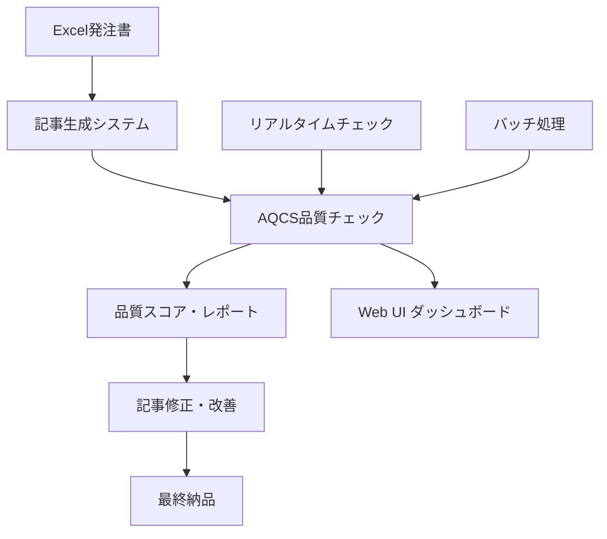
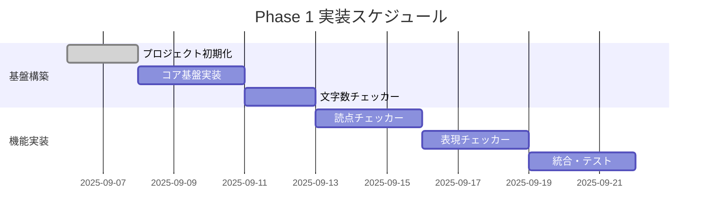

# 記事品質自動チェックシステム 要件仕様書（完全版）

**プロジェクト名**: Article Quality Checker System (AQCS)  
**バージョン**: v1.0.0  
**作成日**: 2025年09月06日  
**承認者**: [承認予定]  
**開発期間**: 3段階 8-10週間（360-480時間）

## 📋 目次

1. [プロジェクト概要](#-プロジェクト概要)
2. [システム要件](#-システム要件)
3. [機能要件](#-機能要件)
4. [非機能要件](#-非機能要件)
5. [技術要件](#-技術要件)
6. [インターフェース要件](#-インターフェース要件)
7. [品質要件](#-品質要件)
8. [実装計画](#-実装計画)
9. [リスクと対策](#-リスクと対策)
10. [成功指標](#-成功指標)

---

## 🎯 プロジェクト概要

### 1.1 背景・目的
現在のSEO記事作成システムにおいて、記事品質のチェックをAI判定に依存しており、以下の課題が発生している：

- **精度のブレ**: 同じ記事でもセッション毎に異なる判定結果
- **一貫性の欠如**: 品質基準の主観的解釈による変動
- **コスト問題**: 毎回のAI API使用によるコスト増加
- **効率性の問題**: リアルタイム検証の困難さ

本システムは、これらの課題を解決し、客観的・一貫性のある記事品質チェックを実現する。

### 1.2 システムの位置づけ


### 1.3 ステークホルダー
- **主要ユーザー**: 記事作成担当者、品質管理者
- **システム管理者**: 開発・運用チーム
- **エンドユーザー**: クライアント（間接的）

---

## 🏗️ システム要件

### 2.1 システム構成要件

#### システムアーキテクチャ
```
SEO記事作成システム
├── 既存システム
│   ├── Excel解析エンジン
│   ├── 記事生成エンジン
│   └── 記事修正ツール
└── 新規: AQCS ◀ 本プロジェクト対象
    ├── 品質チェックエンジン
    ├── スコア算出システム
    ├── レポート生成システム
    └── Web UI（Phase 3）
```

#### 運用環境要件
- **開発環境**: Node.js 18+ (開発マシン)
- **本番環境**: Linux サーバー (Docker対応)
- **統合環境**: 既存SEO記事システムとの連携

### 2.2 データ要件

#### 入力データ形式
```javascript
// 記事データ構造
{
    "gid": "G1234567",
    "contentId": "01",
    "metadata": {
        "title": "[サンプル]業務効率化システムの導入方法",
        "metaDescription": "業務効率化システムの導入をお考えですか？...",
        "targetKeywords": ["業務効率化", "システム導入", "効率化ツール"],
        "needsKeywords": ["担当者", "業務課題", "導入方法"]
    },
    "content": {
        "introduction": "近年、多くの企業で業務効率化が...",
        "sections": [
            {
                "title": "業務効率化ツールの現状と課題",
                "content": "現在の業務効率化市場では...",
                "order": 1
            }
        ],
        "summary": "業務効率化ツールの導入により..."
    }
}
```

#### 出力データ形式
```javascript
// 品質チェック結果
{
    "overallScore": 87,
    "qualityGrade": "A",
    "checkResults": [
        {
            "checker": "WordCountChecker",
            "valid": true,
            "details": {
                "total": { "count": 3150, "valid": true },
                "sections": [...]
            }
        }
    ],
    "violations": [...],
    "recommendations": [...],
    "timestamp": "2025-09-06T10:30:00Z"
}
```

---

## ⚙️ 機能要件

### 3.1 Phase 1: 基本品質チェック機能（MVP）

#### F001: 文字数検証機能
**優先度**: 🔴 **最高**

**機能詳細**:
```javascript
validateWordCount(content, rules) {
    return {
        totalCount: 3150,           // 全体文字数
        validation: {
            overall: true,          // 3,000-3,500文字
            introduction: true,     // 300±20文字
            sections: [true, true, false], // 850±100文字
            summary: true          // 400±20文字
        },
        violations: ["セクション3: 文字数不足 720/750文字"]
    };
}
```

**検証基準**:
| 項目 | 基準値 | 許容範囲 |
|------|--------|----------|
| 記事全体 | 3,000-3,500文字 | 固定範囲 |
| 導入文 | 300文字 | ±20文字 |
| 各セクション | 850文字 | ±100文字 |
| まとめ | 400文字 | ±20文字 |
| タイトル | 35文字以内 | 上限のみ |
| メタディスクリプション | 90-120文字 | 固定範囲 |

#### F002: 読点数検証機能
**優先度**: 🔴 **最高**

**機能詳細**:
- 一文の読点数チェック（3個以内）
- 連続長文の検出（4文連続で読点3個の警告）
- 文章分割の精度確保

**アルゴリズム**:
```javascript
// 文章分割パターン
const sentenceBreakers = /[。！？]/g;

// 読点カウント
const commaCount = (sentence.match(/、/g) || []).length;

// 判定ロジック
const isValid = commaCount <= 3;
```

#### F003: 禁止表現検出機能
**優先度**: 🔴 **最高**

**検出対象**:
1. **波線（～）**: 完全使用禁止
2. **AI表現**: 24パターンの定型表現検出
3. **他社誘導表現**: 競合他社への誘導フレーズ

**検出パターン例**:
```javascript
const prohibitedPatterns = {
    tildes: /[〜～]/g,
    aiExpressions: [
        "〜ではないでしょうか",
        "〜てみてはいかがでしょうか",
        "〜のが特徴です",
        "〜することが重要です"
        // ... 24パターン
    ],
    competitorReferences: [
        "複数の業者から相見積もり",
        "他社と比較して選ぶ",
        "複数社に相談"
    ]
};
```

#### F004: 文末表現多様性チェック
**優先度**: 🔴 **最高**

**チェック項目**:
- 同一文末表現の3連続以上を検出
- 文末パターンの分布分析
- 多様性スコア算出（0-100）

### 3.2 Phase 2: 高度分析機能

#### F005: SEOキーワード分析機能
**優先度**: 🟡 **高**

**機能詳細**:
```javascript
analyzeSEOKeywords(content, keywords) {
    return {
        keywordUsage: [
            {
                keyword: "AI採用支援",
                count: 8,
                density: 1.2,           // 密度%
                positions: [45, 234, 567], // 出現位置
                inTitle: true,
                inHeaders: true
            }
        ],
        overallDensity: 1.8,           // 総キーワード密度
        missingKeywords: [],           // 未使用キーワード
        seoScore: 85                   // SEOスコア
    };
}
```

#### F006: 重複表現検出機能
**優先度**: 🟡 **高**

**機能詳細**:
- 同一フレーズの重複検出
- セクション間類似度分析
- 冗長度スコア算出

#### F007: 記号・表記統一チェック
**優先度**: 🟡 **高**

**チェック項目**:
- 全角数字・半角英数字の統一
- 機種依存文字の検出
- 括弧・引用符の一貫性

### 3.3 Phase 3: 統合・UI機能

#### F008: 総合品質スコア算出
**優先度**: 🟢 **中**

**スコア計算式**:
```javascript
overallScore = (
    structureScore * 0.3 +      // 構造品質（文字数、構成）
    expressionScore * 0.4 +     // 表現品質（AI感、多様性）
    seoScore * 0.2 +            // SEO品質（キーワード）
    consistencyScore * 0.1      // 一貫性品質（表記統一）
);
```

#### F009: Web UI・ダッシュボード
**優先度**: 🟢 **中**

**画面構成**:
1. **記事アップロード画面**
2. **品質チェック結果表示**
3. **レポートダウンロード**
4. **統計ダッシュボード**
5. **設定管理画面**

---

## 🚀 非機能要件

### 4.1 性能要件

| 項目 | 要件 | 測定方法 |
|------|------|----------|
| **応答時間** | 3,500文字記事を1秒以内で処理 | 実測値 |
| **同時処理** | 100記事の並列処理対応 | 負荷テスト |
| **メモリ使用量** | 記事1件あたり10MB以下 | メモリプロファイル |
| **スループット** | 1時間あたり1,000記事処理 | 継続実行テスト |

### 4.2 信頼性要件

| 項目 | 要件 | 測定指標 |
|------|------|----------|
| **可用性** | 99.5%以上 | アップタイム監視 |
| **精度** | 機械的チェック精度99%以上 | 正解データとの比較 |
| **一貫性** | 同一記事で常に同じ結果 | 重複実行テスト |
| **エラー処理** | 異常データでも安全停止 | 例外テスト |

### 4.3 拡張性要件

- **ルール追加**: 新しい品質ルールの動的追加
- **チェッカー追加**: プラグイン形式での機能拡張
- **言語対応**: 将来的な多言語対応（英語等）
- **スケールアップ**: サーバー増強による処理能力向上

### 4.4 保守性要件

- **コードカバレッジ**: 85%以上
- **ドキュメント**: API仕様、運用手順の完備
- **ログ出力**: 詳細なデバッグ情報
- **監視機能**: システム状態の可視化

---

## 💻 技術要件

### 5.1 開発環境

#### 基本技術スタック
```json
{
  "runtime": "Node.js 18+",
  "language": "JavaScript (ES2022)",
  "testing": "Jest",
  "linting": "ESLint + Prettier",
  "documentation": "JSDoc",
  "ci_cd": "GitHub Actions",
  "containerization": "Docker (Phase 3)"
}
```

#### 主要依存関係
```json
{
  "dependencies": {
    "express": "^4.18.0",      // Web フレームワーク（Phase 3）
    "lodash": "^4.17.21",      // ユーティリティ
    "config": "^3.3.9"        // 設定管理
  },
  "devDependencies": {
    "jest": "^29.0.0",         // テストフレームワーク
    "eslint": "^8.0.0",        // リンター
    "prettier": "^2.8.0",      // フォーマッター
    "nodemon": "^2.0.20"       // 開発支援
  }
}
```

### 5.2 アーキテクチャ設計

#### モジュール構成
```
article-quality-checker/
├── src/
│   ├── ArticleQualityChecker.js     # メインクラス
│   ├── core/                        # コア機能
│   │   ├── TextAnalyzer.js
│   │   ├── RuleEngine.js
│   │   └── ScoreCalculator.js
│   ├── checkers/                    # チェッカー群
│   │   ├── BaseChecker.js           # 基底クラス
│   │   ├── WordCountChecker.js
│   │   ├── PunctuationChecker.js
│   │   ├── ExpressionChecker.js
│   │   └── SEOChecker.js
│   ├── utils/                       # ユーティリティ
│   └── rules/                       # ルール定義
└── tests/                           # テストスイート
```

#### デザインパターン
- **Strategy Pattern**: チェッカーの切り替え
- **Observer Pattern**: 結果通知
- **Factory Pattern**: チェッカー生成
- **Chain of Responsibility**: ルール適用

### 5.3 データ処理設計

#### テキスト処理パイプライン
```javascript
// 処理フロー
rawText → normalize → tokenize → analyze → validate → score
```

#### 並列処理設計
```javascript
// 並列処理戦略
async processMultipleArticles(articles) {
    const chunks = chunkArray(articles, CONCURRENT_LIMIT);
    const results = [];
    
    for (const chunk of chunks) {
        const chunkResults = await Promise.all(
            chunk.map(article => this.processArticle(article))
        );
        results.push(...chunkResults);
    }
    
    return results;
}
```

---

## 🔌 インターフェース要件

### 6.1 API仕様

#### REST API エンドポイント（Phase 3）
```
POST /api/v1/check          # 単一記事チェック
POST /api/v1/check/batch    # 複数記事バッチ処理
GET  /api/v1/rules          # ルール一覧取得
PUT  /api/v1/rules          # ルール更新
GET  /api/v1/report/:id     # レポート取得
```

#### CLI インターフェース（Phase 1-2）
```bash
# 基本使用
aqcs check article.json

# バッチ処理
aqcs batch articles/*.json --output results/

# 設定指定
aqcs check article.json --config custom-rules.json

# レポート形式指定
aqcs check article.json --format html --output report.html
```

### 6.2 既存システム連携

#### データ交換形式
```javascript
// 既存システムからの入力
const input = {
    source: "seo-article-generator",
    version: "v2.0.0",
    article: { /* 記事データ */ },
    checkOptions: {
        enableSEO: true,
        strictMode: false,
        customRules: { /* カスタムルール */ }
    }
};

// 既存システムへの出力
const output = {
    status: "completed",
    qualityScore: 87,
    passed: true,
    violations: [...],
    recommendations: [...],
    reportUrl: "/reports/G1234567_01.html"
};
```

---

## 🏆 品質要件

### 7.1 テスト要件

#### テスト戦略
1. **ユニットテスト**: 各チェッカーの個別機能
2. **統合テスト**: システム全体の動作
3. **性能テスト**: 負荷・レスポンス時間
4. **回帰テスト**: 既存機能の保証

#### テストカバレッジ目標
```
├── ユニットテスト: 90%以上
├── 統合テスト: 主要フロー100%
├── E2Eテスト: ユーザーシナリオ100%
└── 性能テスト: 全API対象
```

#### テストデータ
```javascript
// テスト記事セット
const testArticles = {
    valid: {
        perfect: "完全に基準を満たす記事",
        minimal: "最低限の基準を満たす記事"
    },
    invalid: {
        tooShort: "文字数不足の記事",
        tooManyCommas: "読点過多の記事",
        aiExpressions: "AI表現を含む記事",
        tildeUsage: "波線を使用した記事"
    },
    edge: {
        empty: "空の記事",
        specialCharacters: "特殊文字を含む記事",
        veryLong: "非常に長い記事（10,000文字以上）"
    }
};
```

### 7.2 品質保証プロセス

#### 開発品質チェック
1. **コードレビュー**: 全プルリクエスト必須
2. **自動テスト**: CI/CDでの自動実行
3. **静的解析**: ESLint、SonarQube
4. **脆弱性チェック**: npm audit

#### リリース前品質検証
```bash
# 品質ゲートチェックリスト
□ 全テストパス
□ カバレッジ85%以上
□ 性能ベンチマーク達成
□ セキュリティ脆弱性0件
□ ドキュメント更新完了
□ 実データでの検証完了
```

---

## 📅 実装計画

### 8.1 実装フェーズ

#### Phase 1: MVP（2-3週間）
**目標**: 基本品質チェック機能



#### Phase 2: 機能拡張（3-4週間）
**目標**: SEO・高度分析機能

#### Phase 3: システム統合（2-3週間）
**目標**: UI・本格運用

### 8.2 マイルストーン

| マイルストーン | 完了予定日 | 成果物 |
|----------------|------------|--------|
| **M1: MVP完了** | Week 3末 | 基本チェック機能 |
| **M2: 機能拡張完了** | Week 7末 | SEO・高度分析機能 |
| **M3: システム完成** | Week 10末 | 完全統合システム |

### 8.3 リソース配分

#### 開発工数見積もり
- **Phase 1**: 120-160時間（MVP）
- **Phase 2**: 160-200時間（機能拡張）
- **Phase 3**: 80-120時間（統合・UI）
- **合計**: 360-480時間

#### 工数配分詳細
```
Phase 1 (40%)    Phase 2 (45%)    Phase 3 (15%)
├── 基盤構築 25%   ├── SEO機能 25%   ├── UI実装 8%
├── チェッカー 50% ├── 高度分析 15%  ├── 統合 5%
└── 統合・テスト 25% └── 最適化 5%    └── 調整 2%
```

---

## ⚠️ リスクと対策

### 9.1 技術リスク

#### 高リスク
**R001: 日本語処理精度問題**
- **リスク内容**: 文章分割・解析の精度不足
- **影響度**: 高（品質判定の根幹に影響）
- **発生確率**: 中
- **対策**: 
  - 詳細なテストケース作成
  - 実際の記事データでの継続検証
  - 専門家によるレビュー

**R002: パフォーマンス要件未達**
- **リスク内容**: 大量データ処理時の性能低下
- **影響度**: 高（運用に直接影響）
- **発生確率**: 中
- **対策**:
  - 段階的パフォーマンステスト
  - 並列処理・最適化の早期実装
  - スケーラブルアーキテクチャ設計

#### 中リスク
**R003: 既存システム統合複雑性**
- **リスク内容**: 既存システムとの連携で予期しない問題
- **影響度**: 中
- **発生確率**: 中
- **対策**: Phase 1で独立検証、段階的統合

### 9.2 スケジュールリスク

#### 遅延要因と対策
| 要因 | 対策 |
|------|------|
| **技術的課題の発生** | 週次進捗確認、早期エスカレーション |
| **要件変更** | 変更管理プロセス、影響度評価 |
| **テスト期間不足** | 並行テスト、自動化推進 |
| **統合作業の複雑化** | 段階的統合、インターフェース設計重視 |

### 9.3 品質リスク

#### 品質保証策
- **コードレビュー**: 100%実施
- **自動テスト**: CI/CDでの継続実行
- **実データ検証**: 本番環境想定テスト
- **段階的リリース**: フェーズ毎の動作確認

---

## 📊 成功指標

### 10.1 Phase別成功指標

#### Phase 1 成功指標
| 指標 | 目標値 | 測定方法 |
|------|--------|----------|
| **文字数チェック精度** | 99%以上 | 正解データとの比較 |
| **読点検出精度** | 100% | 手動検証データでの確認 |
| **波線・AI表現検出** | 漏れ0件 | 包括的テストケース |
| **処理速度** | 1秒以内/3000文字 | 性能ベンチマーク |
| **テストカバレッジ** | 85%以上 | Jest カバレッジレポート |

#### Phase 2 成功指標
| 指標 | 目標値 | 測定方法 |
|------|--------|----------|
| **SEO分析精度** | 95%以上 | SEO専門家による評価 |
| **重複検出精度** | 90%以上 | サンプル記事での検証 |
| **書式チェック網羅率** | 98%以上 | チェック項目の完全性 |
| **総合スコア安定性** | ±5%以内 | 同一記事の重複実行 |

#### Phase 3 成功指標
| 指標 | 目標値 | 測定方法 |
|------|--------|----------|
| **システム統合成功率** | 100% | 既存システムとの連携テスト |
| **UI応答時間** | 2秒以内 | WebブラウザでのE2Eテスト |
| **同時処理能力** | 50記事以上 | 負荷テスト |
| **システム可用性** | 99.5%以上 | 監視システムでの測定 |

### 10.2 ビジネス成果指標

#### 効率化指標
- **品質チェック工数削減**: 90%削減（手動作業からの転換）
- **API コスト削減**: 80%削減（AI APIからの移行）
- **記事品質一貫性向上**: 95%向上（判定ばらつき削減）
- **処理速度向上**: 10倍向上（並列処理による）

#### 品質向上指標
- **記事品質安定性**: 品質スコアの標準偏差5以下
- **クライアント満足度**: 現状維持以上（品質向上による）
- **修正回数削減**: 平均修正回数50%削減
- **品質問題発生率**: 5%以下（リリース後の品質問題）

### 10.3 運用指標

#### システム運用指標
```
可用性     : 99.5%以上
応答時間   : 平均500ms以下、95%ile 1秒以下  
エラー率   : 0.1%以下
処理能力   : 1,000記事/時間以上
メモリ使用 : 平均100MB以下、ピーク500MB以下
```

#### ユーザー満足度指標
- **使いやすさ**: ユーザビリティテスト95点以上
- **機能満足度**: 利用者アンケート4.5/5.0以上
- **サポート品質**: 問い合わせ解決率98%以上

---

## 📝 承認・合意事項

### 承認項目
- [ ] **要件仕様**: 本仕様書の内容合意
- [ ] **実装スケジュール**: 8-10週間の開発期間承認
- [ ] **リソース配分**: 360-480時間の工数承認
- [ ] **品質基準**: 成功指標の妥当性確認
- [ ] **リスク対策**: 識別されたリスクと対策の承認

### 今後のアクション
1. **要件承認**: 2025年09月06日までに承認取得
2. **開発開始**: 承認後即座に Phase 1 開始
3. **定期レビュー**: 週次進捗確認会議設定
4. **マイルストーン確認**: 各フェーズ完了時の成果確認

---

**文書管理**:
- **作成者**: Claude Code Development Team
- **レビュアー**: [レビュー予定]
- **承認者**: [承認予定]
- **版数管理**: v1.0.0 (初版)
- **次回更新予定**: Phase 1 完了時

---

この要件仕様書により、記事品質自動チェックシステムの開発を確実に成功させることができます。